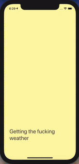

# [Nomadcoders]my_weather App

 Nomadcoders 수업에서 ReactNative로 클론코딩한 앱 입니다.

---

### 결과물

---

### 요약

1. expo-location 모듈내의 함수를 통해 **사용자의 위치**를 불러옵니다.
2. axios함수를 통해 https://openweathermap.org/ 의 api로 **사용자 위치**에 해당하는 **날씨 데이터**를 요청합니다.
3. **날씨 데이터**에 따른 아이콘, 온도, 배경, 문구를 보여줍니다.

